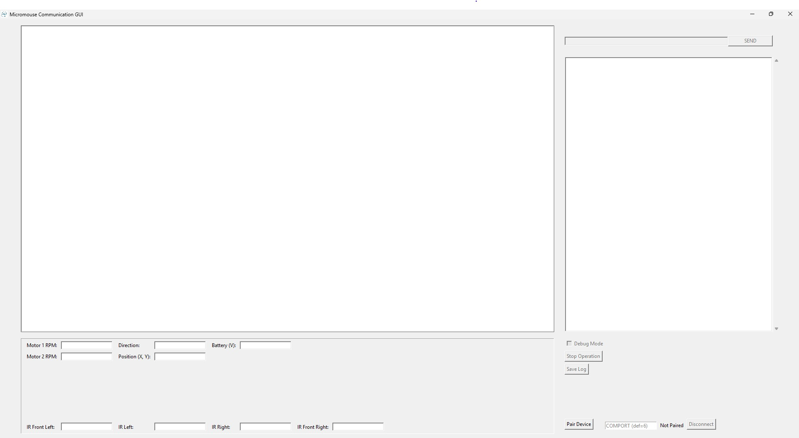
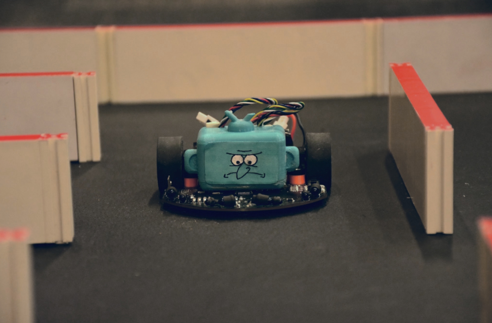

The following repository will contain the work I've done as lead of the UCI Micromouse program. Some of the files included are inaccessible shortcuts and are generally administrative in nature. If you would like access please contact me at 818-233-1594 or nnward2004@icloud.com. 

The PCB is iterative and has had 2 other collaborators work on it in previous years. The PCB design was done in KiCAD 7.0 and the STM32 will be programmed using the STM32CubeIDE. I've changed the motor driver to something more capable than the L293D, added a circuit to protect the microcontroller when both the battery and STLINK are being used in full, and added an extra button. The PCB is 4-layer board with 3 GND planes and 1 power plane (split into +5V and +3V3 sections). I rerouted the entire board to fit in the new circuitry while maintaining the legacy aspects of the schematic. 
There are 2 versions of the design, one using an STM32 bluepill and one using solely the STM32F103C8T6 chip. This is to provide the option for teams that are part of the program to route their own boards using either one. 

Below is the relevant schematic.

Version using STM32 Bluepill front and back. The middle 2 layers of the board are mostly empty asides from a few traces and a GND and power plane, and therefore will not be included by image.

  

Version using STM32F103C8T6 chip front and back. Same as previous in terms of middle 2 layers. 

  

The software is split into 3 main components:
  1. The simulation
  2. The debugging GUI
  3. The firmware
 
1. The first part I worked on was my maze-solving algorithm in mackorone's micromouse simulator (https://github.com/mackorone/mms). Below is a gif of such:

 
2. In parallel with the firmware, I developed a debugging tool using the Python Tkinter library, communicating with a UART bluetooth module on board my micromouse. This tool wasn't fully completed, but was useful for viewing telemetry from my mouse, such as IR sensor readings and battery voltage. If I were to do it again, I would have developed it in Visual Studio using C#, since the toolkits are much more advanced and easier to work with. Nevertheless, it was a good experience implementing wireless communication across a UART serial interface. Below is an image of the tool:

 
3. Lastly, and most importantly, the firmware for my mouse was devleoped in C using the STM32CubeIDE. Below is a link to my best run at competition, where I placed 4th overall:
  

